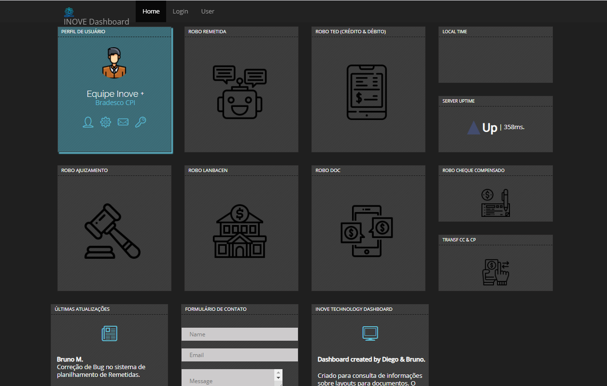

# Consulta-Inove
Projeto profissional de Dashboard feito com HTML5, CSS3, JavaScript, Bootstrap.

 

## :rocket: O Projeto

Esse projeto foi criado com o intuito de facilitar a rotina dos analistas.

Trazendo informações utéis sobre procedimentos e estatísticas.

## :computer: Tecnologias utilizadas
- HTML
- CSS
- JAVASCRIPT
- BOOTSTRAP
- VsCode

## Screen

Produzido por :coffee: Diego.
